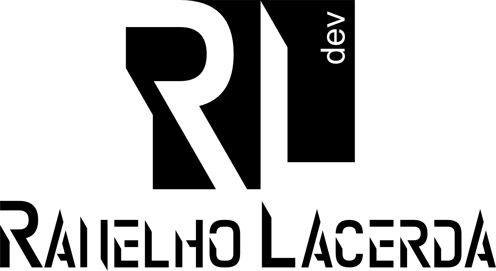

# Sistema de Gestão de Serviços e Equipamentos

### Ajustes e melhorias

O projeto ainda está em desenvolvimento e as próximas atualizações serão voltadas nas seguintes tarefas:

- [x] Equipamento
- [x] Servico
- [x] Ordem de Serviço
- [x] Autenticação via JWT 
- [ ] Relatórios

## 🤝 Colaborador

<table>
  <tr>
    <td align="center">
      <a href="#">
         
        
          <b>Ranelho Lacerda</b>
        
      </a>
    </td>   
  </tr>
</table>

[⬆ Voltar ao topo](#gestao-servicos) 