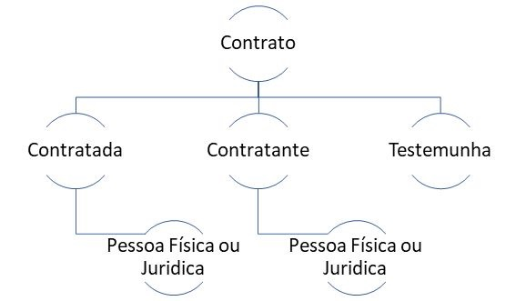
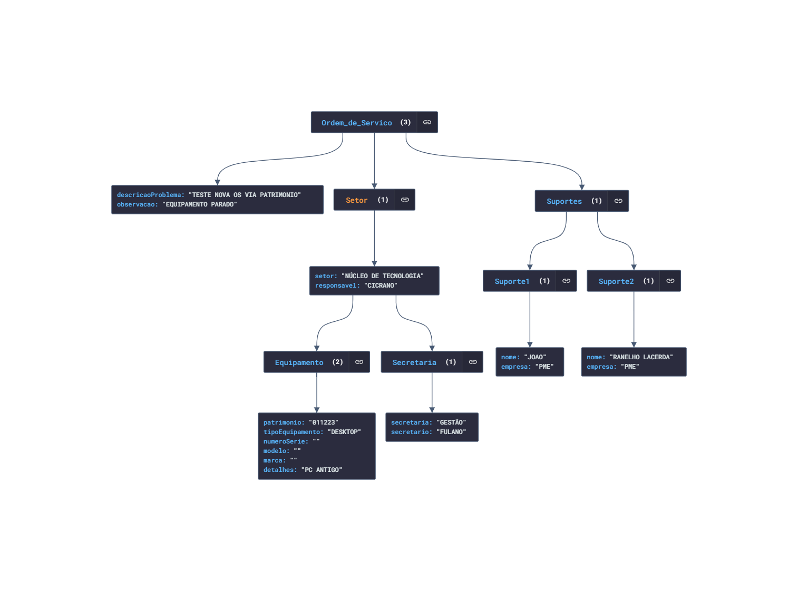

# Sistema de Gestão de Serviços e Equipamentos

 Estrutura

## ✔️ Técnicas e tecnologias utilizadas

- ``Java``
- ``Maven``
- ``JPA``
- ``Lombok``
- ``Spring Boot``
- ``PostgreSQL``
- ``InteliJ IDEA``
- ``JWT``
- ``Swagger``

### Ajustes e melhorias

O projeto ainda está em desenvolvimento e as próximas atualizações serão voltadas nas seguintes tarefas:

- [x] OS
  - [x] Interna - Equipamentos
    - [x] Equipamentos
  - [x] Externa - Serviços
  - [x] Servicos
- [x] Autenticação
  - [x] Usuário
  - [x] Controle de Acesso
  - [x] Token JWT
- [x] Relatórios
- [x] Usuários
  - [x] Contato
  - [x] Regras

 Estrutura

## Autor

 [ Ranelho Lacerda](https://github.com/ranelho) 

[⬆ Voltar ao topo](#gestao-servicos) 